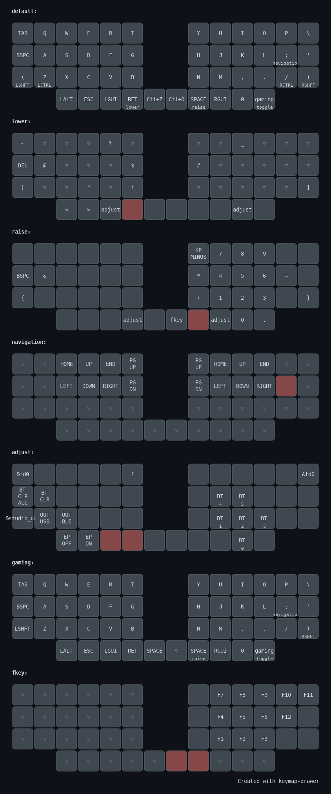

# zmk-config

See [https://github.com/Soakedcardinal/zmk-ws](zmk-ws) for usage instructions

## Keymap

### Helpful Tools

[ZMK Physical Layout Converter](https://zmk-physical-layout-converter.streamlit.app/) | [ZMK Layout Helper](https://zmk-layout-helper.netlify.app/) | [Keymap Drawer](https://keymap-drawer.streamlit.app/)

